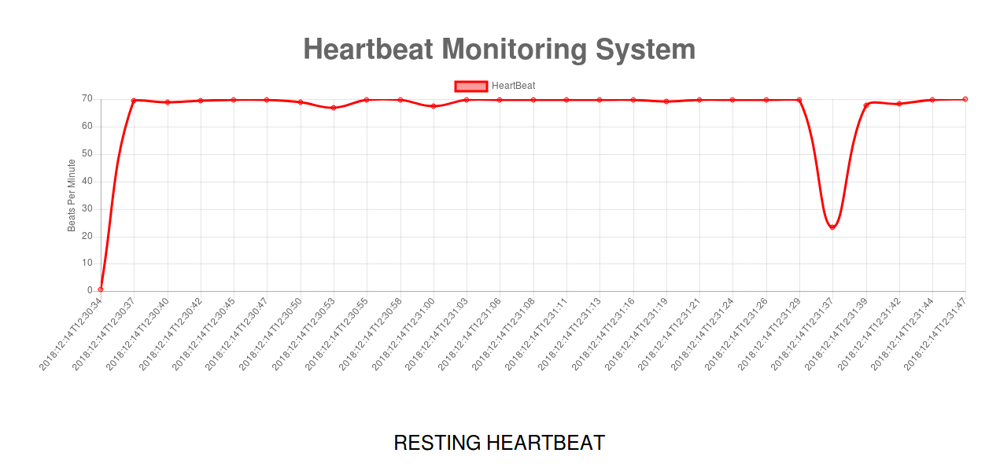

# heartbeat-monitoring-iot
This repo contains code for a web application, which reads the heartbeat from a Sparkfun MAX30105 Pulse Oximetry sensor and sends it to  is connected to an IoT hub using Sparkfun ESP8266 Thing Dev. This real-time data can be seen in a line chart on the web page.<br>
<br>
The heartbeat is classified into three categories (sleeping, resting and running) and displayed below the chart.<br>

## Run a daemon application to send data to your IoT hub
You can refer the related [lesson](https://docs.microsoft.com/en-us/azure/iot-hub/iot-hub-live-data-visualization-in-web-apps) to run an daemon application, to send data to your IoT hub.

## Add new consumer group to your event hub
Go to [Azure Portal](https://portal.azure.com) and select your IoT hub. Click `Endpoints -> Events`, add a new consumer group and then save it.

## Deploy to Azure web application
Go to [Azure Portal](https://portal.azure.com) to create your own Azure web app service. Then do the following setting:

* Go to `Application settings`, add key/value pairs `Azure.IoT.IoTHub.ConnectionString` and `Azure.IoT.IoTHub.ConsumerGroup` to `App settings` slot.
* Go to `Deployment options`, set `Local git repository` to deploy your web app.
* Go to `Deployment credentials`, set your deploy username and password.
* In the `Overview` page, note the `Git clone url`.
* Push the repo's code to the git repo url you note in last step.
* After the push and deploy finished, you can view the page to see the real-time data chart.

## Local deploy
* Open a console and set the following environment variable:
  * `set Azure.IoT.IoTHub.ConnectionString=<your connection string>`
  * `set Azure.IoT.IoTHub.ConsumerGroup=<your consumer group name>`
* Open ./public/javascripts/index.js, and change the code around line 69

    from
    ```js
    var ws = new WebSocket('wss://' + location.host);
    ```
    to
    ```js
    var ws = new WebSocket('ws://' + location.host);
    ```
* `npm install`
* `npm start`

## Application screenshot

<p align="center">
  
</p>
